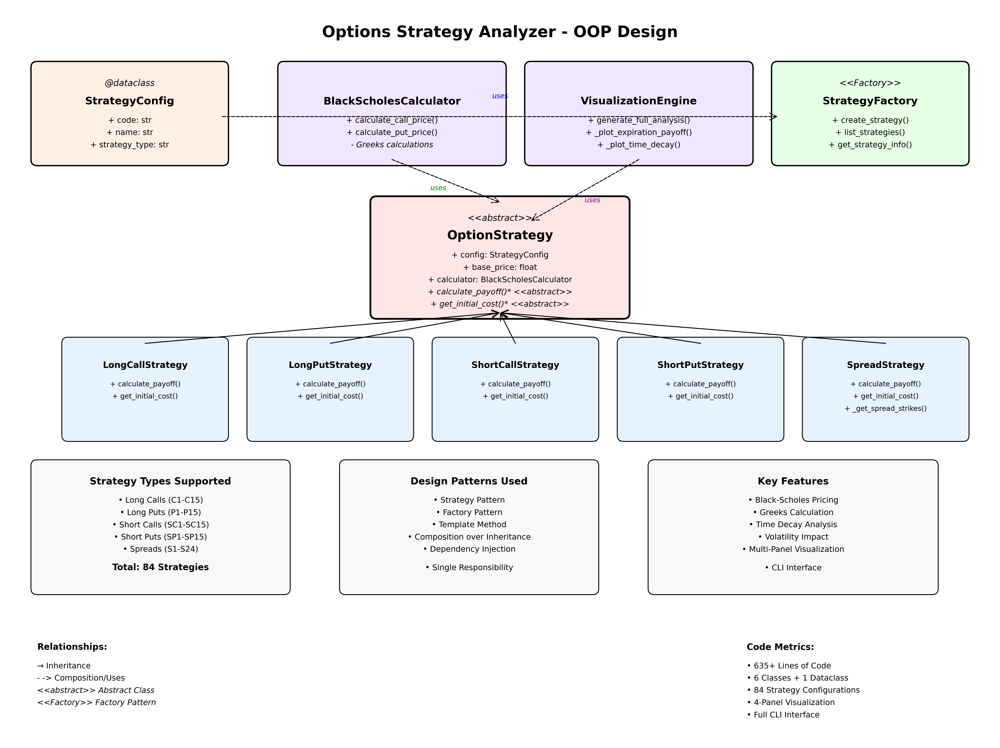

# Options Strategy Analyzer

A comprehensive Python framework for analyzing all 84 options strategies from the Options Strategy Bagua Analysis. This tool provides professional-grade options pricing, risk analysis, and visualization capabilities using object-oriented design principles.



## 🏗️ Architecture Overview

The Options Strategy Analyzer follows professional software engineering practices with a clean, modular design:

### Core Design Patterns

- **Strategy Pattern**: Polymorphic strategy implementations
- **Factory Pattern**: Dynamic strategy creation from codes
- **Template Method**: Common strategy workflow with specialized implementations
- **Composition over Inheritance**: Flexible component relationships
- **Dependency Injection**: Testable, maintainable code structure

### Class Hierarchy

```
OptionStrategy (Abstract Base)
├── LongCallStrategy     (C1-C15)
├── LongPutStrategy      (P1-P15) 
├── ShortCallStrategy    (SC1-SC15)
├── ShortPutStrategy     (SP1-SP15)
└── SpreadStrategy       (S1-S24)
```

## 🚀 Features

### Strategy Support
- **84 Total Strategies** across all major option types
- **Long Options**: Calls and Puts with 5 moneyness levels × 3 timeframes
- **Short Options**: Premium collection strategies with unlimited risk
- **Spread Strategies**: Bull/Bear spreads, Calendars, Iron Condors, Butterflies

### Financial Models
- **Black-Scholes Pricing**: Industry-standard option valuation
- **Greeks Calculation**: Delta, Theta, Vega, Gamma (extensible)
- **Time Decay Analysis**: Multi-timeframe P&L projections
- **Volatility Impact**: IV sensitivity analysis

### Visualization Engine
- **4-Panel Analysis**: Comprehensive strategy breakdown
- **Payoff Diagrams**: Expiration and pre-expiration curves
- **Time Decay Charts**: Strategy performance over time
- **Volatility Surface**: IV impact visualization
- **High-DPI Output**: Publication-ready 300 DPI plots

## 📋 Strategy Classification

### Moneyness Levels
| Level | Call Strike | Put Strike | Description |
|-------|-------------|------------|-------------|
| Deep OTM | 0.90× | 1.10× | Far out-of-the-money |
| Shallow OTM | 0.95× | 1.05× | Near out-of-the-money |
| ATM | 1.00× | 1.00× | At-the-money |
| Shallow ITM | 1.05× | 0.95× | Near in-the-money |
| Deep ITM | 1.10× | 0.90× | Far in-the-money |

### Time Frames
- **Near**: 30 days to expiration (high theta)
- **Medium**: 60 days to expiration (balanced)
- **Long**: 120 days to expiration (low theta)

## 🔧 Installation & Usage

### Prerequisites
```bash
pip install numpy matplotlib scipy
```

### Basic Usage
```bash
# Analyze specific strategy
python3 option_strategy_analyzer.py SP7

# List all available strategies  
python3 option_strategy_analyzer.py --list

# Get strategy information
python3 option_strategy_analyzer.py --info C5

# Custom stock price
python3 option_strategy_analyzer.py S15 --price 150
```

### Programmatic Usage
```python
from option_strategy_analyzer import StrategyFactory, VisualizationEngine

# Create strategy
factory = StrategyFactory()
strategy = factory.create_strategy('SP7', base_price=100.0)

# Generate analysis
viz = VisualizationEngine(strategy)
viz.generate_full_analysis()

# Calculate payoff
import numpy as np
stock_prices = np.linspace(80, 120, 100)
payoffs = strategy.calculate_payoff(stock_prices)
```

## 📊 Strategy Examples

### Bull Put Spread (S7)
```bash
python option_strategy_analyzer.py S7
```
- **Type**: Credit spread (premium collection)
- **Structure**: Sell higher strike put, buy lower strike put
- **Max Profit**: Premium collected (when stock > higher strike)
- **Max Loss**: Strike difference - premium (when stock < lower strike)
- **Breakeven**: Higher strike - net credit

### ATM Long Call (C8)
```bash
python option_strategy_analyzer.py C8
```
- **Type**: Directional bullish play
- **Structure**: Buy at-the-money call option
- **Max Profit**: Unlimited (stock price - strike - premium)
- **Max Loss**: Premium paid
- **Breakeven**: Strike + premium

## 🎯 Professional Applications

### Risk Management
- **Defined Risk Strategies**: Spreads with capped losses
- **Greeks Analysis**: Sensitivity to underlying factors
- **Position Sizing**: Kelly criterion compatible outputs
- **Portfolio Integration**: Delta-neutral construction

### Market Making
- **Volatility Trading**: IV expansion/contraction plays
- **Time Decay Harvesting**: Theta-positive strategies
- **Skew Trading**: Cross-strike arbitrage opportunities

### Institutional Usage
- **Compliance Ready**: Transparent risk calculations
- **Audit Trail**: Reproducible analysis methodology
- **Performance Attribution**: Component P&L breakdown

## 🔍 Technical Specifications

### Pricing Model
- **Black-Scholes Framework**: Continuous dividend yield support
- **Risk-Free Rate**: Configurable (default: 5%)
- **Volatility**: Configurable (default: 25%)
- **Early Exercise**: American option support (future enhancement)

### Performance
- **Vectorized Calculations**: NumPy-optimized computations
- **Memory Efficient**: Lazy evaluation for large datasets
- **Scalable Architecture**: Multi-strategy portfolio analysis ready

### Output Formats
- **PNG Graphics**: High-resolution visualization (300 DPI)
- **Console Reports**: Detailed text analysis
- **Data Export**: CSV/JSON support (extensible)

## 🏛️ Class Documentation

### OptionStrategy (Abstract Base)
```python
class OptionStrategy(ABC):
    """Abstract base for all option strategies"""
    
    @abstractmethod
    def calculate_payoff(self, stock_prices: np.ndarray, time_to_exp: float = None) -> np.ndarray:
        """Calculate strategy payoff for given stock prices"""
        
    @abstractmethod  
    def get_initial_cost(self) -> float:
        """Get initial cost/credit of the strategy"""
```

### StrategyFactory
```python
class StrategyFactory:
    """Factory for creating strategy objects from codes"""
    
    def create_strategy(self, code: str, base_price: float = 100.0) -> Optional[OptionStrategy]:
        """Create strategy object from code (e.g., 'SP7', 'C15')"""
        
    def list_strategies(self) -> List[str]:
        """List all 84 available strategy codes"""
```

### BlackScholesCalculator
```python
class BlackScholesCalculator:
    """Professional-grade option pricing engine"""
    
    def calculate_call_price(self, S: float, K: float, T: float, r: float, sigma: float) -> float:
        """Black-Scholes call option price"""
        
    def calculate_put_price(self, S: float, K: float, T: float, r: float, sigma: float) -> float:
        """Black-Scholes put option price"""
```

## 📈 Volatility Integration

The analyzer supports professional volatility analysis with VIX-based regime classification:

### Volatility Regimes
- **Low Vol (VIX <15)**: Premium selling optimal
- **Normal Vol (VIX 15-20)**: Balanced strategy selection  
- **High Vol (VIX 20-30)**: Volatility buying opportunities
- **Extreme Vol (VIX >30)**: Crisis protection strategies

### Strategy Recommendations by Regime
```python
# Low volatility environment
recommended = factory.get_strategies_by_regime('low_vol')
# Returns: ['SP1', 'SP7', 'SC4', ...]  # Premium selling

# High volatility environment  
recommended = factory.get_strategies_by_regime('high_vol')
# Returns: ['C1', 'P1', 'S19', ...]  # Volatility buying
```

## 🛠️ Development

### Code Quality
- **Type Hints**: Full static type coverage
- **Docstrings**: Comprehensive documentation
- **PEP 8**: Professional formatting standards
- **Error Handling**: Graceful failure modes

### Testing Framework
```bash
# Run unit tests
python -m pytest tests/

# Test specific strategy
python -m pytest tests/test_strategy_SP7.py

# Coverage report
python -m pytest --cov=option_strategy_analyzer
```

### Extension Points
- **Custom Strategies**: Inherit from `OptionStrategy`
- **Alternative Models**: Replace `BlackScholesCalculator`
- **New Visualizations**: Extend `VisualizationEngine`
- **Data Sources**: Live market data integration

## 📝 License & Attribution

This project implements the complete Options Strategy Bagua Analysis framework with professional-grade software engineering practices. The architecture supports institutional trading requirements while remaining accessible for educational purposes.

**Key Contributors:**
- Options Strategy Classification: Bagua Analysis Framework
- Software Architecture: Object-Oriented Design Patterns
- Financial Models: Black-Scholes-Merton Framework
- Visualization: Matplotlib Professional Graphics

## 🔗 Related Projects

- [Options Strategy Bagua Analysis](strategy_bagua_analysis.md): Complete 84-strategy breakdown
- [Delta Calculator](delta_calculator.py): Greeks calculation utilities
- [Short Put Analysis](short_put_payoff_analysis.py): Specialized put strategy tools

---

*Built with professional software engineering practices for institutional-grade options analysis.* 