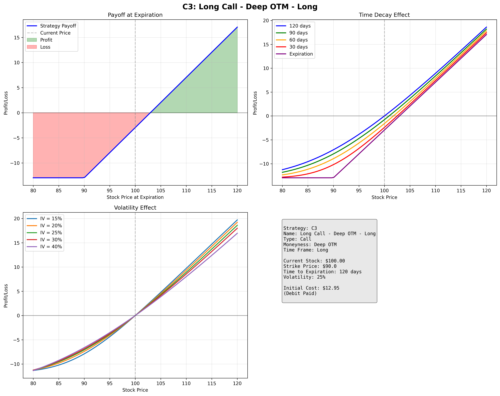
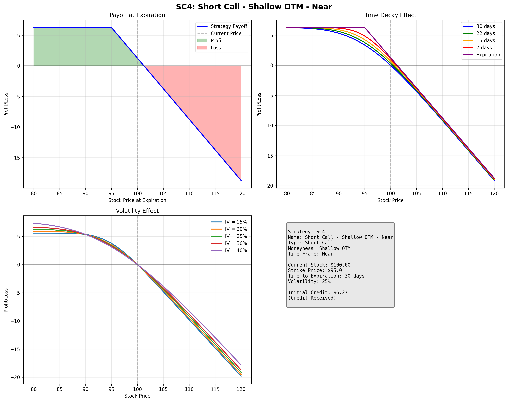
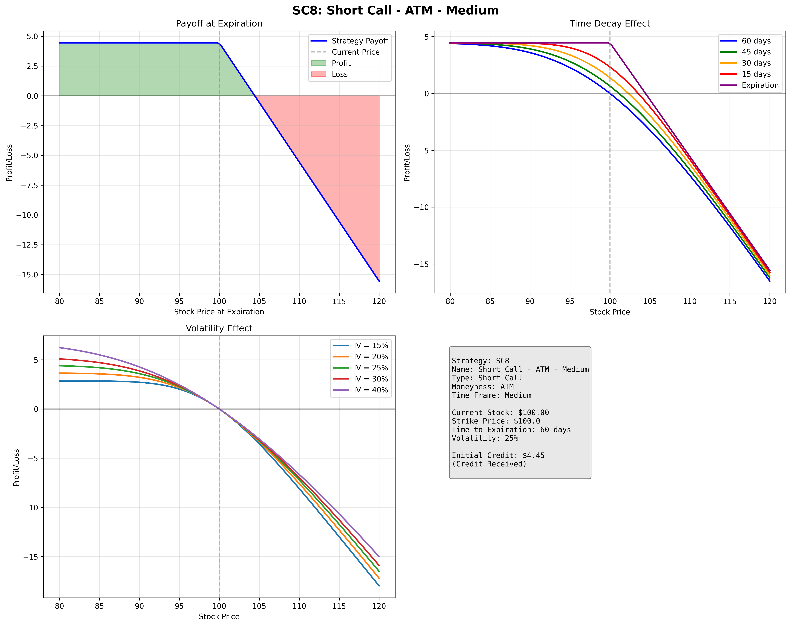

# Complete Options Strategy Analysis - All 84 Strategies

This comprehensive document contains visual analysis for all 84 options strategies from the Options Strategy Bagua Analysis.

**Generated on:** 2025-08-06 14:36:04
**Total Strategies:** 84
**Base Stock Price:** $100.00

## Table of Contents

- [Long Call Strategies (C1-C15)](#long-call-strategies-c1-c15)
  - [C1: Long Call - Deep OTM - Near](#c1)
  - [C2: Long Call - Deep OTM - Medium](#c2)
  - [C3: Long Call - Deep OTM - Long](#c3)
  - [C4: Long Call - Shallow OTM - Near](#c4)
  - [C5: Long Call - Shallow OTM - Medium](#c5)
  - [C6: Long Call - Shallow OTM - Long](#c6)
  - [C7: Long Call - ATM - Near](#c7)
  - [C8: Long Call - ATM - Medium](#c8)
  - [C9: Long Call - ATM - Long](#c9)
  - [C10: Long Call - Shallow ITM - Near](#c10)
  - [C11: Long Call - Shallow ITM - Medium](#c11)
  - [C12: Long Call - Shallow ITM - Long](#c12)
  - [C13: Long Call - Deep ITM - Near](#c13)
  - [C14: Long Call - Deep ITM - Medium](#c14)
  - [C15: Long Call - Deep ITM - Long](#c15)
- [Long Put Strategies (P1-P15)](#long-put-strategies-p1-p15)
  - [P1: Long Put - Deep OTM - Near](#p1)
  - [P2: Long Put - Deep OTM - Medium](#p2)
  - [P3: Long Put - Deep OTM - Long](#p3)
  - [P4: Long Put - Shallow OTM - Near](#p4)
  - [P5: Long Put - Shallow OTM - Medium](#p5)
  - [P6: Long Put - Shallow OTM - Long](#p6)
  - [P7: Long Put - ATM - Near](#p7)
  - [P8: Long Put - ATM - Medium](#p8)
  - [P9: Long Put - ATM - Long](#p9)
  - [P10: Long Put - Shallow ITM - Near](#p10)
  - [P11: Long Put - Shallow ITM - Medium](#p11)
  - [P12: Long Put - Shallow ITM - Long](#p12)
  - [P13: Long Put - Deep ITM - Near](#p13)
  - [P14: Long Put - Deep ITM - Medium](#p14)
  - [P15: Long Put - Deep ITM - Long](#p15)
- [Short Call Strategies (SC1-SC15)](#short-call-strategies-sc1-sc15)
  - [SC1: Short Call - Deep OTM - Near](#sc1)
  - [SC2: Short Call - Deep OTM - Medium](#sc2)
  - [SC3: Short Call - Deep OTM - Long](#sc3)
  - [SC4: Short Call - Shallow OTM - Near](#sc4)
  - [SC5: Short Call - Shallow OTM - Medium](#sc5)
  - [SC6: Short Call - Shallow OTM - Long](#sc6)
  - [SC7: Short Call - ATM - Near](#sc7)
  - [SC8: Short Call - ATM - Medium](#sc8)
  - [SC9: Short Call - ATM - Long](#sc9)
  - [SC10: Short Call - Shallow ITM - Near](#sc10)
  - [SC11: Short Call - Shallow ITM - Medium](#sc11)
  - [SC12: Short Call - Shallow ITM - Long](#sc12)
  - [SC13: Short Call - Deep ITM - Near](#sc13)
  - [SC14: Short Call - Deep ITM - Medium](#sc14)
  - [SC15: Short Call - Deep ITM - Long](#sc15)
- [Short Put Strategies (SP1-SP15)](#short-put-strategies-sp1-sp15)
  - [SP1: Short Put - Deep OTM - Near](#sp1)
  - [SP2: Short Put - Deep OTM - Medium](#sp2)
  - [SP3: Short Put - Deep OTM - Long](#sp3)
  - [SP4: Short Put - Shallow OTM - Near](#sp4)
  - [SP5: Short Put - Shallow OTM - Medium](#sp5)
  - [SP6: Short Put - Shallow OTM - Long](#sp6)
  - [SP7: Short Put - ATM - Near](#sp7)
  - [SP8: Short Put - ATM - Medium](#sp8)
  - [SP9: Short Put - ATM - Long](#sp9)
  - [SP10: Short Put - Shallow ITM - Near](#sp10)
  - [SP11: Short Put - Shallow ITM - Medium](#sp11)
  - [SP12: Short Put - Shallow ITM - Long](#sp12)
  - [SP13: Short Put - Deep ITM - Near](#sp13)
  - [SP14: Short Put - Deep ITM - Medium](#sp14)
  - [SP15: Short Put - Deep ITM - Long](#sp15)
- [Spread Strategies (S1-S24)](#spread-strategies-s1-s24)
  - [S1: Bull Call Spread - Near](#s1)
  - [S2: Bull Call Spread - Medium](#s2)
  - [S3: Bull Call Spread - Long](#s3)
  - [S4: Bear Call Spread - Near](#s4)
  - [S5: Bear Call Spread - Medium](#s5)
  - [S6: Bear Call Spread - Long](#s6)
  - [S7: Bull Put Spread - Near](#s7)
  - [S8: Bull Put Spread - Medium](#s8)
  - [S9: Bull Put Spread - Long](#s9)
  - [S10: Bear Put Spread - Near](#s10)
  - [S11: Bear Put Spread - Medium](#s11)
  - [S12: Bear Put Spread - Long](#s12)
  - [S13: Calendar Spread - Near](#s13)
  - [S14: Calendar Spread - Medium](#s14)
  - [S15: Ratio Spread - Long](#s15)
  - [S16: Ratio Spread - Near](#s16)
  - [S17: Back Ratio Spread - Medium](#s17)
  - [S18: Back Ratio Spread - Long](#s18)
  - [S19: Iron Condor - Near](#s19)
  - [S20: Iron Condor - Medium](#s20)
  - [S21: Iron Condor - Long](#s21)
  - [S22: Butterfly Spread - Near](#s22)
  - [S23: Butterfly Spread - Medium](#s23)
  - [S24: Butterfly Spread - Long](#s24)

---

## Long Call Strategies (C1-C15)

### C1

**Strategy:** Long Call - Deep OTM - Near
**Type:** Call
**Moneyness:** Deep OTM
**Time Frame:** Near
**Description:** Buy Deep OTM call option, Near expiration

**Bagua Analysis:**
- **Risk Level:** L
- **Max Profit Potential:** H
- **Leverage:** E (1000%+)
- **Risk/Reward Rating:** E
- **Breakeven:** P
- **Suitable Markets:** Strike + Premium
- **Unsuitable Markets:** Strong Bull, News Catalyst, Regime Shift
- **Key Characteristics:** Sideways, Bear, High IV, Stable Regime

**Analysis Chart:**

---

### C2

**Strategy:** Long Call - Deep OTM - Medium
**Type:** Call
**Moneyness:** Deep OTM
**Time Frame:** Medium
**Description:** Buy Deep OTM call option, Medium expiration

**Bagua Analysis:**
- **Risk Level:** L-M
- **Max Profit Potential:** H
- **Leverage:** E (500-1000%)
- **Risk/Reward Rating:** H
- **Breakeven:** F
- **Suitable Markets:** Strike + Premium
- **Unsuitable Markets:** Gradual Bull, Earnings Play, Vol Regime Change
- **Key Characteristics:** Sideways, Bear, Vol Crush, Stable Regime

**Analysis Chart:**

---

### C3

**Strategy:** Long Call - Deep OTM - Long
**Type:** Call
**Moneyness:** Deep OTM
**Time Frame:** Long
**Description:** Buy Deep OTM call option, Long expiration

**Bagua Analysis:**
- **Risk Level:** M
- **Max Profit Potential:** M-H
- **Leverage:** H (200-500%)
- **Risk/Reward Rating:** H
- **Breakeven:** G
- **Suitable Markets:** Strike + Premium
- **Unsuitable Markets:** Long Bull Trend, Low IV, Structural Bull Regime
- **Key Characteristics:** Range-bound, High IV, Bear Regime Shift

**Analysis Chart:**

---

### C4

**Strategy:** Long Call - Shallow OTM - Near
**Type:** Call
**Moneyness:** Shallow OTM
**Time Frame:** Near
**Description:** Buy Shallow OTM call option, Near expiration

**Bagua Analysis:**
- **Risk Level:** M
- **Max Profit Potential:** M-H
- **Leverage:** H (200-500%)
- **Risk/Reward Rating:** H
- **Breakeven:** F
- **Suitable Markets:** Strike + Premium
- **Unsuitable Markets:** Strong Bull, Breakout, Momentum Regime
- **Key Characteristics:** Sideways, Bear, Time Decay, Range Regime

**Analysis Chart:**

---

### C5

**Strategy:** Long Call - Shallow OTM - Medium
**Type:** Call
**Moneyness:** Shallow OTM
**Time Frame:** Medium
**Description:** Buy Shallow OTM call option, Medium expiration

**Bagua Analysis:**
- **Risk Level:** M
- **Max Profit Potential:** M
- **Leverage:** H (100-300%)
- **Risk/Reward Rating:** M-H
- **Breakeven:** G
- **Suitable Markets:** Strike + Premium
- **Unsuitable Markets:** Steady Bull, Earnings, Growth Regime
- **Key Characteristics:** Sideways, Vol Crush, Recession Regime

**Analysis Chart:**

---

### C6

**Strategy:** Long Call - Shallow OTM - Long
**Type:** Call
**Moneyness:** Shallow OTM
**Time Frame:** Long
**Description:** Buy Shallow OTM call option, Long expiration

**Bagua Analysis:**
- **Risk Level:** M-H
- **Max Profit Potential:** M
- **Leverage:** M-H (50-200%)
- **Risk/Reward Rating:** M
- **Breakeven:** G
- **Suitable Markets:** Strike + Premium
- **Unsuitable Markets:** Bull Trend, Low IV Buy, Expansion Regime
- **Key Characteristics:** Bear Market, High IV, Contraction Regime

**Analysis Chart:**

---

### C7

**Strategy:** Long Call - ATM - Near
**Type:** Call
**Moneyness:** ATM
**Time Frame:** Near
**Description:** Buy ATM call option, Near expiration

**Bagua Analysis:**
- **Risk Level:** M-H
- **Max Profit Potential:** M
- **Leverage:** M-H (100-200%)
- **Risk/Reward Rating:** M
- **Breakeven:** F
- **Suitable Markets:** Strike + Premium
- **Unsuitable Markets:** Bull Momentum, Volatility, Trending Regime
- **Key Characteristics:** Sideways, Time Decay, Range Regime

**Analysis Chart:**

---

### C8

**Strategy:** Long Call - ATM - Medium
**Type:** Call
**Moneyness:** ATM
**Time Frame:** Medium
**Description:** Buy ATM call option, Medium expiration

**Bagua Analysis:**
- **Risk Level:** H
- **Max Profit Potential:** M
- **Leverage:** M (50-150%)
- **Risk/Reward Rating:** M
- **Breakeven:** G
- **Suitable Markets:** Strike + Premium
- **Unsuitable Markets:** Bull Trend, Vol Expansion, Growth Regime
- **Key Characteristics:** Range-bound, Vol Crush, Stagnation Regime

**Analysis Chart:**

---

### C9

**Strategy:** Long Call - ATM - Long
**Type:** Call
**Moneyness:** ATM
**Time Frame:** Long
**Description:** Buy ATM call option, Long expiration

**Bagua Analysis:**
- **Risk Level:** H
- **Max Profit Potential:** L-M
- **Leverage:** M (30-100%)
- **Risk/Reward Rating:** L-M
- **Breakeven:** G
- **Suitable Markets:** Strike + Premium
- **Unsuitable Markets:** Long Bull, Low IV, Secular Bull Regime
- **Key Characteristics:** High IV, Mean Reversion, Bear Regime

**Analysis Chart:**

---

### C10

**Strategy:** Long Call - Shallow ITM - Near
**Type:** Call
**Moneyness:** Shallow ITM
**Time Frame:** Near
**Description:** Buy Shallow ITM call option, Near expiration

**Bagua Analysis:**
- **Risk Level:** H
- **Max Profit Potential:** L-M
- **Leverage:** M (20-100%)
- **Risk/Reward Rating:** L-M
- **Breakeven:** G
- **Suitable Markets:** Strike + Premium
- **Unsuitable Markets:** Bull Continuation, Momentum Regime
- **Key Characteristics:** Sideways, High Decay, Range Regime

**Analysis Chart:**

---

### C11

**Strategy:** Long Call - Shallow ITM - Medium
**Type:** Call
**Moneyness:** Shallow ITM
**Time Frame:** Medium
**Description:** Buy Shallow ITM call option, Medium expiration

**Bagua Analysis:**
- **Risk Level:** H
- **Max Profit Potential:** L
- **Leverage:** L-M (15-75%)
- **Risk/Reward Rating:** L-M
- **Breakeven:** E
- **Suitable Markets:** Strike + Premium
- **Unsuitable Markets:** Steady Bull, Protection, Stable Bull Regime
- **Key Characteristics:** Vol Crush, Reversal, Regime Shift

**Analysis Chart:**

---

### C12

**Strategy:** Long Call - Shallow ITM - Long
**Type:** Call
**Moneyness:** Shallow ITM
**Time Frame:** Long
**Description:** Buy Shallow ITM call option, Long expiration

**Bagua Analysis:**
- **Risk Level:** H
- **Max Profit Potential:** L
- **Leverage:** L-M (10-50%)
- **Risk/Reward Rating:** L
- **Breakeven:** E
- **Suitable Markets:** Strike + Premium
- **Unsuitable Markets:** Conservative Bull, Long-term Bull Regime
- **Key Characteristics:** High IV Purchase, Bear Regime Shift

**Analysis Chart:**

---

### C13

**Strategy:** Long Call - Deep ITM - Near
**Type:** Call
**Moneyness:** Deep ITM
**Time Frame:** Near
**Description:** Buy Deep ITM call option, Near expiration

**Bagua Analysis:**
- **Risk Level:** H
- **Max Profit Potential:** L
- **Leverage:** L (5-30%)
- **Risk/Reward Rating:** L
- **Breakeven:** F
- **Suitable Markets:** Strike + Premium
- **Unsuitable Markets:** Bull Certainty, Income, Any Regime
- **Key Characteristics:** Time Decay, Reversal, Major Regime Shift

**Analysis Chart:**

---

### C14

**Strategy:** Long Call - Deep ITM - Medium
**Type:** Call
**Moneyness:** Deep ITM
**Time Frame:** Medium
**Description:** Buy Deep ITM call option, Medium expiration

**Bagua Analysis:**
- **Risk Level:** H
- **Max Profit Potential:** L
- **Leverage:** L (5-25%)
- **Risk/Reward Rating:** L
- **Breakeven:** F
- **Suitable Markets:** Strike + Premium
- **Unsuitable Markets:** Steady Income, Bull, Stable Regime
- **Key Characteristics:** Vol Crush, Range, Rate Regime Shift

**Analysis Chart:**

---

### C15

**Strategy:** Long Call - Deep ITM - Long
**Type:** Call
**Moneyness:** Deep ITM
**Time Frame:** Long
**Description:** Buy Deep ITM call option, Long expiration

**Bagua Analysis:**
- **Risk Level:** H
- **Max Profit Potential:** L
- **Leverage:** L (3-20%)
- **Risk/Reward Rating:** L
- **Breakeven:** F
- **Suitable Markets:** Strike + Premium
- **Unsuitable Markets:** Long Bull, Dividend Play, Any Regime
- **Key Characteristics:** Opportunity Cost, Bear Regime Shift

**Analysis Chart:**

---

## Long Put Strategies (P1-P15)

### P1

**Strategy:** Long Put - Deep OTM - Near
**Type:** Put
**Moneyness:** Deep OTM
**Time Frame:** Near
**Description:** Buy Deep OTM put option, Near expiration

**Bagua Analysis:**
- **Risk Level:** L
- **Max Profit Potential:** H
- **Leverage:** E (1000%+)
- **Risk/Reward Rating:** E
- **Breakeven:** P
- **Suitable Markets:** Strike - Premium
- **Unsuitable Markets:** Crash, Black Swan, Bear Regime Shift
- **Key Characteristics:** Sideways, Bull, High IV, Stable Bull Regime

**Analysis Chart:**

---

### P2

**Strategy:** Long Put - Deep OTM - Medium
**Type:** Put
**Moneyness:** Deep OTM
**Time Frame:** Medium
**Description:** Buy Deep OTM put option, Medium expiration

**Bagua Analysis:**
- **Risk Level:** L-M
- **Max Profit Potential:** H
- **Leverage:** E (500-1000%)
- **Risk/Reward Rating:** H
- **Breakeven:** F
- **Suitable Markets:** Strike - Premium
- **Unsuitable Markets:** Bear Market, Recession, Economic Regime Shift
- **Key Characteristics:** Bull, Vol Crush, Growth Regime

**Analysis Chart:**

---

### P3

**Strategy:** Long Put - Deep OTM - Long
**Type:** Put
**Moneyness:** Deep OTM
**Time Frame:** Long
**Description:** Buy Deep OTM put option, Long expiration

**Bagua Analysis:**
- **Risk Level:** M
- **Max Profit Potential:** M-H
- **Leverage:** H (200-500%)
- **Risk/Reward Rating:** H
- **Breakeven:** G
- **Suitable Markets:** Strike - Premium
- **Unsuitable Markets:** Long Bear, Market Top, Structural Bear Regime
- **Key Characteristics:** Bull Trend, High IV, Bull Regime Shift

**Analysis Chart:**

---

### P4

**Strategy:** Long Put - Shallow OTM - Near
**Type:** Put
**Moneyness:** Shallow OTM
**Time Frame:** Near
**Description:** Buy Shallow OTM put option, Near expiration

**Bagua Analysis:**
- **Risk Level:** M
- **Max Profit Potential:** M-H
- **Leverage:** H (200-500%)
- **Risk/Reward Rating:** H
- **Breakeven:** F
- **Suitable Markets:** Strike - Premium
- **Unsuitable Markets:** Bear Break, Correction, Volatility Regime
- **Key Characteristics:** Bull, Sideways, Low Vol Regime

**Analysis Chart:**

---

### P5

**Strategy:** Long Put - Shallow OTM - Medium
**Type:** Put
**Moneyness:** Shallow OTM
**Time Frame:** Medium
**Description:** Buy Shallow OTM put option, Medium expiration

**Bagua Analysis:**
- **Risk Level:** M
- **Max Profit Potential:** M
- **Leverage:** H (100-300%)
- **Risk/Reward Rating:** M-H
- **Breakeven:** G
- **Suitable Markets:** Strike - Premium
- **Unsuitable Markets:** Bear Trend, Earnings Miss, Contraction Regime
- **Key Characteristics:** Bull, Vol Crush, Expansion Regime

**Analysis Chart:**

---

### P6

**Strategy:** Long Put - Shallow OTM - Long
**Type:** Put
**Moneyness:** Shallow OTM
**Time Frame:** Long
**Description:** Buy Shallow OTM put option, Long expiration

**Bagua Analysis:**
- **Risk Level:** M-H
- **Max Profit Potential:** M
- **Leverage:** M-H (50-200%)
- **Risk/Reward Rating:** M
- **Breakeven:** G
- **Suitable Markets:** Strike - Premium
- **Unsuitable Markets:** Long Bear, High IV, Secular Bear Regime
- **Key Characteristics:** Bull Market, Low IV, Bull Regime

**Analysis Chart:**

---

### P7

**Strategy:** Long Put - ATM - Near
**Type:** Put
**Moneyness:** ATM
**Time Frame:** Near
**Description:** Buy ATM put option, Near expiration

**Bagua Analysis:**
- **Risk Level:** M-H
- **Max Profit Potential:** M
- **Leverage:** M-H (100-200%)
- **Risk/Reward Rating:** M
- **Breakeven:** F
- **Suitable Markets:** Strike - Premium
- **Unsuitable Markets:** Bear Momentum, Vol, Trending Down Regime
- **Key Characteristics:** Bull, Time Decay, Range Regime

**Analysis Chart:**

---

### P8

**Strategy:** Long Put - ATM - Medium
**Type:** Put
**Moneyness:** ATM
**Time Frame:** Medium
**Description:** Buy ATM put option, Medium expiration

**Bagua Analysis:**
- **Risk Level:** H
- **Max Profit Potential:** M
- **Leverage:** M (50-150%)
- **Risk/Reward Rating:** M
- **Breakeven:** G
- **Suitable Markets:** Strike - Premium
- **Unsuitable Markets:** Bear Trend, Protection, Defensive Regime
- **Key Characteristics:** Bull, Vol Crush, Growth Regime

**Analysis Chart:**

---

### P9

**Strategy:** Long Put - ATM - Long
**Type:** Put
**Moneyness:** ATM
**Time Frame:** Long
**Description:** Buy ATM put option, Long expiration

**Bagua Analysis:**
- **Risk Level:** H
- **Max Profit Potential:** L-M
- **Leverage:** M (30-100%)
- **Risk/Reward Rating:** L-M
- **Breakeven:** G
- **Suitable Markets:** Strike - Premium
- **Unsuitable Markets:** Long Bear, Insurance, Risk-Off Regime
- **Key Characteristics:** Bull Trend, Low Vol, Risk-On Regime

**Analysis Chart:**

---

### P10

**Strategy:** Long Put - Shallow ITM - Near
**Type:** Put
**Moneyness:** Shallow ITM
**Time Frame:** Near
**Description:** Buy Shallow ITM put option, Near expiration

**Bagua Analysis:**
- **Risk Level:** H
- **Max Profit Potential:** L-M
- **Leverage:** M (20-100%)
- **Risk/Reward Rating:** L-M
- **Breakeven:** G
- **Suitable Markets:** Strike - Premium
- **Unsuitable Markets:** Bear Continuation, Momentum Down Regime
- **Key Characteristics:** Bull, High Decay, Range Regime

**Analysis Chart:**

---

### P11

**Strategy:** Long Put - Shallow ITM - Medium
**Type:** Put
**Moneyness:** Shallow ITM
**Time Frame:** Medium
**Description:** Buy Shallow ITM put option, Medium expiration

**Bagua Analysis:**
- **Risk Level:** H
- **Max Profit Potential:** L
- **Leverage:** L-M (15-75%)
- **Risk/Reward Rating:** L-M
- **Breakeven:** E
- **Suitable Markets:** Strike - Premium
- **Unsuitable Markets:** Steady Bear, Hedge, Stable Bear Regime
- **Key Characteristics:** Bull Trend, Vol Crush, Bull Regime Shift

**Analysis Chart:**

---

### P12

**Strategy:** Long Put - Shallow ITM - Long
**Type:** Put
**Moneyness:** Shallow ITM
**Time Frame:** Long
**Description:** Buy Shallow ITM put option, Long expiration

**Bagua Analysis:**
- **Risk Level:** H
- **Max Profit Potential:** L
- **Leverage:** L-M (10-50%)
- **Risk/Reward Rating:** L
- **Breakeven:** E
- **Suitable Markets:** Strike - Premium
- **Unsuitable Markets:** Conservative Bear, Long-term Bear Regime
- **Key Characteristics:** Bull Market, Bull Regime Shift

**Analysis Chart:**

---

### P13

**Strategy:** Long Put - Deep ITM - Near
**Type:** Put
**Moneyness:** Deep ITM
**Time Frame:** Near
**Description:** Buy Deep ITM put option, Near expiration

**Bagua Analysis:**
- **Risk Level:** H
- **Max Profit Potential:** L
- **Leverage:** L (5-30%)
- **Risk/Reward Rating:** L
- **Breakeven:** F
- **Suitable Markets:** Strike - Premium
- **Unsuitable Markets:** Bear Certainty, Any Regime
- **Key Characteristics:** Bull, Time Decay, Major Bull Regime Shift

**Analysis Chart:**

---

### P14

**Strategy:** Long Put - Deep ITM - Medium
**Type:** Put
**Moneyness:** Deep ITM
**Time Frame:** Medium
**Description:** Buy Deep ITM put option, Medium expiration

**Bagua Analysis:**
- **Risk Level:** H
- **Max Profit Potential:** L
- **Leverage:** L (5-25%)
- **Risk/Reward Rating:** L
- **Breakeven:** F
- **Suitable Markets:** Strike - Premium
- **Unsuitable Markets:** Income, Bear, Stable Regime
- **Key Characteristics:** Bull Market, Rate Regime Shift

**Analysis Chart:**

---

### P15

**Strategy:** Long Put - Deep ITM - Long
**Type:** Put
**Moneyness:** Deep ITM
**Time Frame:** Long
**Description:** Buy Deep ITM put option, Long expiration

**Bagua Analysis:**
- **Risk Level:** H
- **Max Profit Potential:** L
- **Leverage:** L (3-20%)
- **Risk/Reward Rating:** L
- **Breakeven:** F
- **Suitable Markets:** Strike - Premium
- **Unsuitable Markets:** Long Bear, Dividend, Any Regime
- **Key Characteristics:** Opportunity Cost, Bull Regime Shift

**Analysis Chart:**

---

## Short Call Strategies (SC1-SC15)

### SC1

**Strategy:** Short Call - Deep OTM - Near
**Type:** Short_Call
**Moneyness:** Deep OTM
**Time Frame:** Near
**Description:** Sell Deep OTM call option, Near expiration

**Bagua Analysis:**
- **Risk Level:** Credit
- **Max Profit Potential:** U
- **Leverage:** L (Premium)
- **Risk/Reward Rating:** E
- **Breakeven:** F
- **Suitable Markets:** Strike + Premium
- **Unsuitable Markets:** Sideways, Bear, High IV, Range Regime
- **Key Characteristics:** Strong Bull, News Catalyst, Low IV

**Analysis Chart:**

---

### SC2

**Strategy:** Short Call - Deep OTM - Medium
**Type:** Short_Call
**Moneyness:** Deep OTM
**Time Frame:** Medium
**Description:** Sell Deep OTM call option, Medium expiration

**Bagua Analysis:**
- **Risk Level:** Credit
- **Max Profit Potential:** U
- **Leverage:** L-M (Premium)
- **Risk/Reward Rating:** H
- **Breakeven:** F
- **Suitable Markets:** Strike + Premium
- **Unsuitable Markets:** Range-bound, Bear, High IV, Stable Regime
- **Key Characteristics:** Gradual Bull, Vol Expansion, Breakout

**Analysis Chart:**

---

### SC3

**Strategy:** Short Call - Deep OTM - Long
**Type:** Short_Call
**Moneyness:** Deep OTM
**Time Frame:** Long
**Description:** Sell Deep OTM call option, Long expiration

**Bagua Analysis:**
- **Risk Level:** Credit
- **Max Profit Potential:** U
- **Leverage:** M (Premium)
- **Risk/Reward Rating:** H
- **Breakeven:** F
- **Suitable Markets:** Strike + Premium
- **Unsuitable Markets:** Long Bear/Range, High IV, Bear Regime
- **Key Characteristics:** Long Bull Trend, Bull Regime Shift

**Analysis Chart:**

---

### SC4

**Strategy:** Short Call - Shallow OTM - Near
**Type:** Short_Call
**Moneyness:** Shallow OTM
**Time Frame:** Near
**Description:** Sell Shallow OTM call option, Near expiration

**Bagua Analysis:**
- **Risk Level:** Credit
- **Max Profit Potential:** U
- **Leverage:** L-M (Premium)
- **Risk/Reward Rating:** H
- **Breakeven:** F
- **Suitable Markets:** Strike + Premium
- **Unsuitable Markets:** Sideways, Bear, High IV, Range Regime
- **Key Characteristics:** Strong Bull, Momentum, Low IV

**Analysis Chart:**

---

### SC5

**Strategy:** Short Call - Shallow OTM - Medium
**Type:** Short_Call
**Moneyness:** Shallow OTM
**Time Frame:** Medium
**Description:** Sell Shallow OTM call option, Medium expiration

**Bagua Analysis:**
- **Risk Level:** Credit
- **Max Profit Potential:** U
- **Leverage:** M (Premium)
- **Risk/Reward Rating:** M-H
- **Breakeven:** F
- **Suitable Markets:** Strike + Premium
- **Unsuitable Markets:** Range-bound, Bear, High IV, Recession Regime
- **Key Characteristics:** Steady Bull, Growth Regime, Earnings

**Analysis Chart:**

---

### SC6

**Strategy:** Short Call - Shallow OTM - Long
**Type:** Short_Call
**Moneyness:** Shallow OTM
**Time Frame:** Long
**Description:** Sell Shallow OTM call option, Long expiration

**Bagua Analysis:**
- **Risk Level:** Credit
- **Max Profit Potential:** U
- **Leverage:** M-H (Premium)
- **Risk/Reward Rating:** M
- **Breakeven:** F
- **Suitable Markets:** Strike + Premium
- **Unsuitable Markets:** Long Bear/Range, High IV, Contraction Regime
- **Key Characteristics:** Bull Trend, Expansion Regime, Low IV

**Analysis Chart:**

---

### SC7

**Strategy:** Short Call - ATM - Near
**Type:** Short_Call
**Moneyness:** ATM
**Time Frame:** Near
**Description:** Sell ATM call option, Near expiration

**Bagua Analysis:**
- **Risk Level:** Credit
- **Max Profit Potential:** U
- **Leverage:** M (Premium)
- **Risk/Reward Rating:** M
- **Breakeven:** F
- **Suitable Markets:** Strike + Premium
- **Unsuitable Markets:** Sideways, Bear, High IV, Range Regime
- **Key Characteristics:** Bull Momentum, Trending, Low IV

**Analysis Chart:**

---

### SC8

**Strategy:** Short Call - ATM - Medium
**Type:** Short_Call
**Moneyness:** ATM
**Time Frame:** Medium
**Description:** Sell ATM call option, Medium expiration

**Bagua Analysis:**
- **Risk Level:** Credit
- **Max Profit Potential:** U
- **Leverage:** M-H (Premium)
- **Risk/Reward Rating:** M
- **Breakeven:** F
- **Suitable Markets:** Strike + Premium
- **Unsuitable Markets:** Range-bound, Bear, High IV, Stagnation Regime
- **Key Characteristics:** Bull Trend, Growth Regime, Vol Expansion

**Analysis Chart:**

---

### SC9

**Strategy:** Short Call - ATM - Long
**Type:** Short_Call
**Moneyness:** ATM
**Time Frame:** Long
**Description:** Sell ATM call option, Long expiration

**Bagua Analysis:**
- **Risk Level:** Credit
- **Max Profit Potential:** U
- **Leverage:** H (Premium)
- **Risk/Reward Rating:** L-M
- **Breakeven:** G
- **Suitable Markets:** Strike + Premium
- **Unsuitable Markets:** Long Bear/Range, High IV, Bear Regime
- **Key Characteristics:** Long Bull, Bull Regime, Low IV

**Analysis Chart:**

---

### SC10

**Strategy:** Short Call - Shallow ITM - Near
**Type:** Short_Call
**Moneyness:** Shallow ITM
**Time Frame:** Near
**Description:** Sell Shallow ITM call option, Near expiration

**Bagua Analysis:**
- **Risk Level:** Credit
- **Max Profit Potential:** U
- **Leverage:** M-H (Premium)
- **Risk/Reward Rating:** L-M
- **Breakeven:** F
- **Suitable Markets:** Strike + Premium
- **Unsuitable Markets:** Sideways, Bear, High IV, Range Regime
- **Key Characteristics:** Bull Continuation, Momentum, Low IV

**Analysis Chart:**

---

### SC11

**Strategy:** Short Call - Shallow ITM - Medium
**Type:** Short_Call
**Moneyness:** Shallow ITM
**Time Frame:** Medium
**Description:** Sell Shallow ITM call option, Medium expiration

**Bagua Analysis:**
- **Risk Level:** Credit
- **Max Profit Potential:** U
- **Leverage:** H (Premium)
- **Risk/Reward Rating:** L-M
- **Breakeven:** G
- **Suitable Markets:** Strike + Premium
- **Unsuitable Markets:** Range-bound, Bear, High IV, Bear Regime
- **Key Characteristics:** Steady Bull, Bull Regime, Vol Expansion

**Analysis Chart:**

---

### SC12

**Strategy:** Short Call - Shallow ITM - Long
**Type:** Short_Call
**Moneyness:** Shallow ITM
**Time Frame:** Long
**Description:** Sell Shallow ITM call option, Long expiration

**Bagua Analysis:**
- **Risk Level:** Credit
- **Max Profit Potential:** U
- **Leverage:** H (Premium)
- **Risk/Reward Rating:** L
- **Breakeven:** E
- **Suitable Markets:** Strike + Premium
- **Unsuitable Markets:** Long Bear/Range, High IV, Bear Regime
- **Key Characteristics:** Conservative Bull, Bull Regime Shift

**Analysis Chart:**

---

### SC13

**Strategy:** Short Call - Deep ITM - Near
**Type:** Short_Call
**Moneyness:** Deep ITM
**Time Frame:** Near
**Description:** Sell Deep ITM call option, Near expiration

**Bagua Analysis:**
- **Risk Level:** Credit
- **Max Profit Potential:** U
- **Leverage:** H (Premium)
- **Risk/Reward Rating:** L
- **Breakeven:** G
- **Suitable Markets:** Strike + Premium
- **Unsuitable Markets:** Bear Certainty, High IV, Any Regime
- **Key Characteristics:** Bull Certainty, Bull Regime, Low IV

**Analysis Chart:**

---

### SC14

**Strategy:** Short Call - Deep ITM - Medium
**Type:** Short_Call
**Moneyness:** Deep ITM
**Time Frame:** Medium
**Description:** Sell Deep ITM call option, Medium expiration

**Bagua Analysis:**
- **Risk Level:** Credit
- **Max Profit Potential:** U
- **Leverage:** H (Premium)
- **Risk/Reward Rating:** L
- **Breakeven:** G
- **Suitable Markets:** Strike + Premium
- **Unsuitable Markets:** Bear Market, High IV, Bear Regime
- **Key Characteristics:** Steady Bull, Bull Regime, Vol Expansion

**Analysis Chart:**

---

### SC15

**Strategy:** Short Call - Deep ITM - Long
**Type:** Short_Call
**Moneyness:** Deep ITM
**Time Frame:** Long
**Description:** Sell Deep ITM call option, Long expiration

**Bagua Analysis:**
- **Risk Level:** Credit
- **Max Profit Potential:** U
- **Leverage:** H (Premium)
- **Risk/Reward Rating:** L
- **Breakeven:** E
- **Suitable Markets:** Strike + Premium
- **Unsuitable Markets:** Long Bear, High IV, Bear Regime
- **Key Characteristics:** Long Bull, Bull Regime Shift, Low IV

**Analysis Chart:**

---

## Short Put Strategies (SP1-SP15)

### SP1

**Strategy:** Short Put - Deep OTM - Near
**Type:** Short_Put
**Moneyness:** Deep OTM
**Time Frame:** Near
**Description:** Sell Deep OTM put option, Near expiration

**Bagua Analysis:**
- **Risk Level:** Credit
- **Max Profit Potential:** L
- **Leverage:** L (Premium)
- **Risk/Reward Rating:** E
- **Breakeven:** F
- **Suitable Markets:** Strike - Premium
- **Unsuitable Markets:** Bull, Sideways, High IV, Stable Bull Regime
- **Key Characteristics:** Crash, Bear Regime Shift, Low IV

**Analysis Chart:**

---

### SP2

**Strategy:** Short Put - Deep OTM - Medium
**Type:** Short_Put
**Moneyness:** Deep OTM
**Time Frame:** Medium
**Description:** Sell Deep OTM put option, Medium expiration

**Bagua Analysis:**
- **Risk Level:** Credit
- **Max Profit Potential:** L
- **Leverage:** L-M (Premium)
- **Risk/Reward Rating:** H
- **Breakeven:** F
- **Suitable Markets:** Strike - Premium
- **Unsuitable Markets:** Bull, Range-bound, High IV, Growth Regime
- **Key Characteristics:** Bear Market, Recession, Vol Expansion

**Analysis Chart:**

---

### SP3

**Strategy:** Short Put - Deep OTM - Long
**Type:** Short_Put
**Moneyness:** Deep OTM
**Time Frame:** Long
**Description:** Sell Deep OTM put option, Long expiration

**Bagua Analysis:**
- **Risk Level:** Credit
- **Max Profit Potential:** M
- **Leverage:** M (Premium)
- **Risk/Reward Rating:** H
- **Breakeven:** F
- **Suitable Markets:** Strike - Premium
- **Unsuitable Markets:** Long Bull, High IV, Bull Regime
- **Key Characteristics:** Long Bear, Bear Regime Shift, Low IV

**Analysis Chart:**

---

### SP4

**Strategy:** Short Put - Shallow OTM - Near
**Type:** Short_Put
**Moneyness:** Shallow OTM
**Time Frame:** Near
**Description:** Sell Shallow OTM put option, Near expiration

**Bagua Analysis:**
- **Risk Level:** Credit
- **Max Profit Potential:** M
- **Leverage:** L-M (Premium)
- **Risk/Reward Rating:** H
- **Breakeven:** F
- **Suitable Markets:** Strike - Premium
- **Unsuitable Markets:** Bull, Sideways, High IV, Low Vol Regime
- **Key Characteristics:** Bear Break, Volatility Regime, Low IV

**Analysis Chart:**

---

### SP5

**Strategy:** Short Put - Shallow OTM - Medium
**Type:** Short_Put
**Moneyness:** Shallow OTM
**Time Frame:** Medium
**Description:** Sell Shallow OTM put option, Medium expiration

**Bagua Analysis:**
- **Risk Level:** Credit
- **Max Profit Potential:** M
- **Leverage:** M (Premium)
- **Risk/Reward Rating:** M-H
- **Breakeven:** G
- **Suitable Markets:** Strike - Premium
- **Unsuitable Markets:** Bull, Range-bound, High IV, Expansion Regime
- **Key Characteristics:** Bear Trend, Contraction Regime, Vol Expansion

**Analysis Chart:**

---

### SP6

**Strategy:** Short Put - Shallow OTM - Long
**Type:** Short_Put
**Moneyness:** Shallow OTM
**Time Frame:** Long
**Description:** Sell Shallow OTM put option, Long expiration

**Bagua Analysis:**
- **Risk Level:** Credit
- **Max Profit Potential:** M
- **Leverage:** M-H (Premium)
- **Risk/Reward Rating:** M
- **Breakeven:** G
- **Suitable Markets:** Strike - Premium
- **Unsuitable Markets:** Long Bull, High IV, Bull Regime
- **Key Characteristics:** Long Bear, Bear Regime, Low IV

**Analysis Chart:**

---

### SP7

**Strategy:** Short Put - ATM - Near
**Type:** Short_Put
**Moneyness:** ATM
**Time Frame:** Near
**Description:** Sell ATM put option, Near expiration

**Bagua Analysis:**
- **Risk Level:** Credit
- **Max Profit Potential:** M
- **Leverage:** M (Premium)
- **Risk/Reward Rating:** M
- **Breakeven:** F
- **Suitable Markets:** Strike - Premium
- **Unsuitable Markets:** Bull, Sideways, High IV, Range Regime
- **Key Characteristics:** Bear Momentum, Trending Down, Low IV

**Analysis Chart:**

---

### SP8

**Strategy:** Short Put - ATM - Medium
**Type:** Short_Put
**Moneyness:** ATM
**Time Frame:** Medium
**Description:** Sell ATM put option, Medium expiration

**Bagua Analysis:**
- **Risk Level:** Credit
- **Max Profit Potential:** M
- **Leverage:** M-H (Premium)
- **Risk/Reward Rating:** M
- **Breakeven:** G
- **Suitable Markets:** Strike - Premium
- **Unsuitable Markets:** Bull, Range-bound, High IV, Growth Regime
- **Key Characteristics:** Bear Trend, Defensive Regime, Vol Expansion

**Analysis Chart:**

---

### SP9

**Strategy:** Short Put - ATM - Long
**Type:** Short_Put
**Moneyness:** ATM
**Time Frame:** Long
**Description:** Sell ATM put option, Long expiration

**Bagua Analysis:**
- **Risk Level:** Credit
- **Max Profit Potential:** L-M
- **Leverage:** H (Premium)
- **Risk/Reward Rating:** L-M
- **Breakeven:** G
- **Suitable Markets:** Strike - Premium
- **Unsuitable Markets:** Long Bull, High IV, Risk-On Regime
- **Key Characteristics:** Long Bear, Risk-Off Regime, Low IV

**Analysis Chart:**

---

### SP10

**Strategy:** Short Put - Shallow ITM - Near
**Type:** Short_Put
**Moneyness:** Shallow ITM
**Time Frame:** Near
**Description:** Sell Shallow ITM put option, Near expiration

**Bagua Analysis:**
- **Risk Level:** Credit
- **Max Profit Potential:** M
- **Leverage:** M-H (Premium)
- **Risk/Reward Rating:** L-M
- **Breakeven:** F
- **Suitable Markets:** Strike - Premium
- **Unsuitable Markets:** Bull, Sideways, High IV, Range Regime
- **Key Characteristics:** Bear Continuation, Momentum Down, Low IV

**Analysis Chart:**

---

### SP11

**Strategy:** Short Put - Shallow ITM - Medium
**Type:** Short_Put
**Moneyness:** Shallow ITM
**Time Frame:** Medium
**Description:** Sell Shallow ITM put option, Medium expiration

**Bagua Analysis:**
- **Risk Level:** Credit
- **Max Profit Potential:** L
- **Leverage:** H (Premium)
- **Risk/Reward Rating:** L-M
- **Breakeven:** G
- **Suitable Markets:** Strike - Premium
- **Unsuitable Markets:** Bull, Range-bound, High IV, Bull Regime
- **Key Characteristics:** Steady Bear, Bear Regime Shift, Vol Expansion

**Analysis Chart:**

---

### SP12

**Strategy:** Short Put - Shallow ITM - Long
**Type:** Short_Put
**Moneyness:** Shallow ITM
**Time Frame:** Long
**Description:** Sell Shallow ITM put option, Long expiration

**Bagua Analysis:**
- **Risk Level:** Credit
- **Max Profit Potential:** L
- **Leverage:** H (Premium)
- **Risk/Reward Rating:** L
- **Breakeven:** E
- **Suitable Markets:** Strike - Premium
- **Unsuitable Markets:** Long Bull, High IV, Bull Regime
- **Key Characteristics:** Conservative Bear, Bear Regime Shift, Low IV

**Analysis Chart:**

---

### SP13

**Strategy:** Short Put - Deep ITM - Near
**Type:** Short_Put
**Moneyness:** Deep ITM
**Time Frame:** Near
**Description:** Sell Deep ITM put option, Near expiration

**Bagua Analysis:**
- **Risk Level:** Credit
- **Max Profit Potential:** L
- **Leverage:** H (Premium)
- **Risk/Reward Rating:** L
- **Breakeven:** G
- **Suitable Markets:** Strike - Premium
- **Unsuitable Markets:** Bull Certainty, High IV, Any Regime
- **Key Characteristics:** Bear Certainty, Bear Regime, Low IV

**Analysis Chart:**

---

### SP14

**Strategy:** Short Put - Deep ITM - Medium
**Type:** Short_Put
**Moneyness:** Deep ITM
**Time Frame:** Medium
**Description:** Sell Deep ITM put option, Medium expiration

**Bagua Analysis:**
- **Risk Level:** Credit
- **Max Profit Potential:** L
- **Leverage:** H (Premium)
- **Risk/Reward Rating:** L
- **Breakeven:** G
- **Suitable Markets:** Strike - Premium
- **Unsuitable Markets:** Bull Market, High IV, Bull Regime
- **Key Characteristics:** Bear Market, Bear Regime, Vol Expansion

**Analysis Chart:**

---

### SP15

**Strategy:** Short Put - Deep ITM - Long
**Type:** Short_Put
**Moneyness:** Deep ITM
**Time Frame:** Long
**Description:** Sell Deep ITM put option, Long expiration

**Bagua Analysis:**
- **Risk Level:** Credit
- **Max Profit Potential:** L
- **Leverage:** H (Premium)
- **Risk/Reward Rating:** L
- **Breakeven:** E
- **Suitable Markets:** Strike - Premium
- **Unsuitable Markets:** Long Bull, High IV, Bull Regime
- **Key Characteristics:** Long Bear, Bear Regime Shift, Low IV

**Analysis Chart:**

---

## Spread Strategies (S1-S24)

### S1

**Strategy:** Bull Call Spread - Near
**Type:** Spread
**Moneyness:** Mixed
**Time Frame:** Near
**Description:** Bull Call Spread strategy, Near expiration

**Bagua Analysis:**
- **Risk Level:** M
- **Max Profit Potential:** L
- **Leverage:** L (50-200%)
- **Risk/Reward Rating:** M
- **Breakeven:** G
- **Suitable Markets:** Lower Strike + Premium
- **Unsuitable Markets:** Moderate Bull, Defined Risk
- **Key Characteristics:** Strong Bull, Bear, High IV

**Analysis Chart:**

---

### S2

**Strategy:** Bull Call Spread - Medium
**Type:** Spread
**Moneyness:** Mixed
**Time Frame:** Medium
**Description:** Bull Call Spread strategy, Medium expiration

**Bagua Analysis:**
- **Risk Level:** M-H
- **Max Profit Potential:** L
- **Leverage:** L-M (30-150%)
- **Risk/Reward Rating:** M
- **Breakeven:** G
- **Suitable Markets:** Lower Strike + Premium
- **Unsuitable Markets:** Steady Bull, Earnings Play
- **Key Characteristics:** Bear, Vol Crush, Range

**Analysis Chart:**

---

### S3

**Strategy:** Bull Call Spread - Long
**Type:** Spread
**Moneyness:** Mixed
**Time Frame:** Long
**Description:** Bull Call Spread strategy, Long expiration

**Bagua Analysis:**
- **Risk Level:** H
- **Max Profit Potential:** L
- **Leverage:** L-M (20-100%)
- **Risk/Reward Rating:** L-M
- **Breakeven:** E
- **Suitable Markets:** Lower Strike + Premium
- **Unsuitable Markets:** Long Bull, Conservative
- **Key Characteristics:** Bear Regime, High IV Buy

**Analysis Chart:**

---

### S4

**Strategy:** Bear Call Spread - Near
**Type:** Spread
**Moneyness:** Mixed
**Time Frame:** Near
**Description:** Bear Call Spread strategy, Near expiration

**Bagua Analysis:**
- **Risk Level:** Credit
- **Max Profit Potential:** L
- **Leverage:** L (20-100%)
- **Risk/Reward Rating:** L-M
- **Breakeven:** F
- **Suitable Markets:** Upper Strike - Credit
- **Unsuitable Markets:** Sideways, Bear, High IV
- **Key Characteristics:** Strong Bull, Low IV

**Analysis Chart:**

---

### S5

**Strategy:** Bear Call Spread - Medium
**Type:** Spread
**Moneyness:** Mixed
**Time Frame:** Medium
**Description:** Bear Call Spread strategy, Medium expiration

**Bagua Analysis:**
- **Risk Level:** Credit
- **Max Profit Potential:** L
- **Leverage:** L (15-75%)
- **Risk/Reward Rating:** L
- **Breakeven:** F
- **Suitable Markets:** Upper Strike - Credit
- **Unsuitable Markets:** Range-bound, Bear
- **Key Characteristics:** Bull Breakout, Vol Expansion

**Analysis Chart:**

---

### S6

**Strategy:** Bear Call Spread - Long
**Type:** Spread
**Moneyness:** Mixed
**Time Frame:** Long
**Description:** Bear Call Spread strategy, Long expiration

**Bagua Analysis:**
- **Risk Level:** Credit
- **Max Profit Potential:** L
- **Leverage:** L (10-50%)
- **Risk/Reward Rating:** L
- **Breakeven:** F
- **Suitable Markets:** Upper Strike - Credit
- **Unsuitable Markets:** Long-term Bear/Range
- **Key Characteristics:** Bull Regime Shift

**Analysis Chart:**

---

### S7

**Strategy:** Bull Put Spread - Near
**Type:** Spread
**Moneyness:** Mixed
**Time Frame:** Near
**Description:** Bull Put Spread strategy, Near expiration

**Bagua Analysis:**
- **Risk Level:** Credit
- **Max Profit Potential:** L
- **Leverage:** L (20-100%)
- **Risk/Reward Rating:** L-M
- **Breakeven:** G
- **Suitable Markets:** Higher Strike - Credit
- **Unsuitable Markets:** Bull, High IV Sell
- **Key Characteristics:** Bear Break, Low IV

**Analysis Chart:**

---

### S8

**Strategy:** Bull Put Spread - Medium
**Type:** Spread
**Moneyness:** Mixed
**Time Frame:** Medium
**Description:** Bull Put Spread strategy, Medium expiration

**Bagua Analysis:**
- **Risk Level:** Credit
- **Max Profit Potential:** L
- **Leverage:** L-M (15-75%)
- **Risk/Reward Rating:** L
- **Breakeven:** G
- **Suitable Markets:** Higher Strike - Credit
- **Unsuitable Markets:** Steady Bull, Vol Crush
- **Key Characteristics:** Bear Trend, Vol Expansion

**Analysis Chart:**

---

### S9

**Strategy:** Bull Put Spread - Long
**Type:** Spread
**Moneyness:** Mixed
**Time Frame:** Long
**Description:** Bull Put Spread strategy, Long expiration

**Bagua Analysis:**
- **Risk Level:** Credit
- **Max Profit Potential:** L
- **Leverage:** L (10-50%)
- **Risk/Reward Rating:** L
- **Breakeven:** E
- **Suitable Markets:** Higher Strike - Credit
- **Unsuitable Markets:** Long Bull, Premium Income
- **Key Characteristics:** Bear Regime, Rate Shifts

**Analysis Chart:**

---

### S10

**Strategy:** Bear Put Spread - Near
**Type:** Spread
**Moneyness:** Mixed
**Time Frame:** Near
**Description:** Bear Put Spread strategy, Near expiration

**Bagua Analysis:**
- **Risk Level:** M
- **Max Profit Potential:** L
- **Leverage:** L (50-200%)
- **Risk/Reward Rating:** M
- **Breakeven:** G
- **Suitable Markets:** Higher Strike + Premium
- **Unsuitable Markets:** Bear Break, Protection
- **Key Characteristics:** Bull, High IV Purchase

**Analysis Chart:**

---

### S11

**Strategy:** Bear Put Spread - Medium
**Type:** Spread
**Moneyness:** Mixed
**Time Frame:** Medium
**Description:** Bear Put Spread strategy, Medium expiration

**Bagua Analysis:**
- **Risk Level:** M-H
- **Max Profit Potential:** L
- **Leverage:** L-M (30-150%)
- **Risk/Reward Rating:** M
- **Breakeven:** G
- **Suitable Markets:** Higher Strike + Premium
- **Unsuitable Markets:** Bear Trend, Hedge
- **Key Characteristics:** Bull Market, Vol Crush

**Analysis Chart:**

---

### S12

**Strategy:** Bear Put Spread - Long
**Type:** Spread
**Moneyness:** Mixed
**Time Frame:** Long
**Description:** Bear Put Spread strategy, Long expiration

**Bagua Analysis:**
- **Risk Level:** H
- **Max Profit Potential:** L
- **Leverage:** L-M (20-100%)
- **Risk/Reward Rating:** L-M
- **Breakeven:** E
- **Suitable Markets:** Higher Strike + Premium
- **Unsuitable Markets:** Long Bear, Insurance
- **Key Characteristics:** Bull Regime, Opportunity Cost

**Analysis Chart:**

---

### S13

**Strategy:** Calendar Spread - Near
**Type:** Spread
**Moneyness:** Mixed
**Time Frame:** Near
**Description:** Calendar Spread strategy, Near expiration

**Bagua Analysis:**
- **Risk Level:** M
- **Max Profit Potential:** M
- **Leverage:** M (30-150%)
- **Risk/Reward Rating:** M
- **Breakeven:** G
- **Suitable Markets:** Complex Calculation
- **Unsuitable Markets:** Low Vol, Time Decay
- **Key Characteristics:** High Vol, Direction

**Analysis Chart:**

---

### S14

**Strategy:** Calendar Spread - Medium
**Type:** Spread
**Moneyness:** Mixed
**Time Frame:** Medium
**Description:** Calendar Spread strategy, Medium expiration

**Bagua Analysis:**
- **Risk Level:** M-H
- **Max Profit Potential:** M
- **Leverage:** M-H (20-100%)
- **Risk/Reward Rating:** M
- **Breakeven:** F
- **Suitable Markets:** Complex Calculation
- **Unsuitable Markets:** Stable Markets, Vol Crush
- **Key Characteristics:** Trending, Vol Expansion

**Analysis Chart:**

---

### S15

**Strategy:** Ratio Spread - Long
**Type:** Spread
**Moneyness:** Mixed
**Time Frame:** Long
**Description:** Ratio Spread strategy, Long expiration

**Bagua Analysis:**
- **Risk Level:** L-Credit
- **Max Profit Potential:** H
- **Leverage:** H-U (200%+)
- **Risk/Reward Rating:** H
- **Breakeven:** F
- **Suitable Markets:** Net Strike Calculation
- **Unsuitable Markets:** Moderate Bull, Vol Sell
- **Key Characteristics:** Strong Bull, Vol Expansion

**Analysis Chart:**

---

### S16

**Strategy:** Ratio Spread - Near
**Type:** Spread
**Moneyness:** Mixed
**Time Frame:** Near
**Description:** Ratio Spread strategy, Near expiration

**Bagua Analysis:**
- **Risk Level:** L-Credit
- **Max Profit Potential:** H
- **Leverage:** H-U (100-300%)
- **Risk/Reward Rating:** H
- **Breakeven:** F
- **Suitable Markets:** Net Strike Calculation
- **Unsuitable Markets:** Range-bound, High IV
- **Key Characteristics:** Trending, Low IV

**Analysis Chart:**

---

### S17

**Strategy:** Back Ratio Spread - Medium
**Type:** Spread
**Moneyness:** Mixed
**Time Frame:** Medium
**Description:** Back Ratio Spread strategy, Medium expiration

**Bagua Analysis:**
- **Risk Level:** M-H
- **Max Profit Potential:** M-H
- **Leverage:** H-U (300%+)
- **Risk/Reward Rating:** H
- **Breakeven:** F
- **Suitable Markets:** Net Strike Calculation
- **Unsuitable Markets:** High Vol, Direction
- **Key Characteristics:** Low Vol, Range

**Analysis Chart:**

---

### S18

**Strategy:** Back Ratio Spread - Long
**Type:** Spread
**Moneyness:** Mixed
**Time Frame:** Long
**Description:** Back Ratio Spread strategy, Long expiration

**Bagua Analysis:**
- **Risk Level:** H
- **Max Profit Potential:** M-H
- **Leverage:** H-U (200-500%)
- **Risk/Reward Rating:** H
- **Breakeven:** G
- **Suitable Markets:** Net Strike Calculation
- **Unsuitable Markets:** Vol Expansion, Breakout
- **Key Characteristics:** Vol Crush, Sideways

**Analysis Chart:**

---

### S19

**Strategy:** Iron Condor - Near
**Type:** Spread
**Moneyness:** Mixed
**Time Frame:** Near
**Description:** Iron Condor strategy, Near expiration

**Bagua Analysis:**
- **Risk Level:** Credit
- **Max Profit Potential:** L
- **Leverage:** L (10-50%)
- **Risk/Reward Rating:** L-M
- **Breakeven:** E
- **Suitable Markets:** Middle Range
- **Unsuitable Markets:** Range-bound, High IV
- **Key Characteristics:** Trending, Low IV

**Analysis Chart:**

---

### S20

**Strategy:** Iron Condor - Medium
**Type:** Spread
**Moneyness:** Mixed
**Time Frame:** Medium
**Description:** Iron Condor strategy, Medium expiration

**Bagua Analysis:**
- **Risk Level:** Credit
- **Max Profit Potential:** L
- **Leverage:** L-M (8-40%)
- **Risk/Reward Rating:** L
- **Breakeven:** E
- **Suitable Markets:** Middle Range
- **Unsuitable Markets:** Sideways, Vol Crush
- **Key Characteristics:** Breakout, Vol Expansion

**Analysis Chart:**

---

### S21

**Strategy:** Iron Condor - Long
**Type:** Spread
**Moneyness:** Mixed
**Time Frame:** Long
**Description:** Iron Condor strategy, Long expiration

**Bagua Analysis:**
- **Risk Level:** Credit
- **Max Profit Potential:** L
- **Leverage:** L (5-30%)
- **Risk/Reward Rating:** L
- **Breakeven:** F
- **Suitable Markets:** Middle Range
- **Unsuitable Markets:** Long-term Range
- **Key Characteristics:** Regime Shifts, Trends

**Analysis Chart:**

---

### S22

**Strategy:** Butterfly Spread - Near
**Type:** Spread
**Moneyness:** Mixed
**Time Frame:** Near
**Description:** Butterfly Spread strategy, Near expiration

**Bagua Analysis:**
- **Risk Level:** M
- **Max Profit Potential:** L
- **Leverage:** L (50-300%)
- **Risk/Reward Rating:** M
- **Breakeven:** G
- **Suitable Markets:** Middle Strike
- **Unsuitable Markets:** Low Vol, Pin Risk
- **Key Characteristics:** High Vol, Movement

**Analysis Chart:**

---

### S23

**Strategy:** Butterfly Spread - Medium
**Type:** Spread
**Moneyness:** Mixed
**Time Frame:** Medium
**Description:** Butterfly Spread strategy, Medium expiration

**Bagua Analysis:**
- **Risk Level:** M-H
- **Max Profit Potential:** L
- **Leverage:** L-M (30-200%)
- **Risk/Reward Rating:** M
- **Breakeven:** G
- **Suitable Markets:** Middle Strike
- **Unsuitable Markets:** Range-bound, Vol Sell
- **Key Characteristics:** Trending, Vol Buy

**Analysis Chart:**

---

### S24

**Strategy:** Butterfly Spread - Long
**Type:** Spread
**Moneyness:** Mixed
**Time Frame:** Long
**Description:** Butterfly Spread strategy, Long expiration

**Bagua Analysis:**
- **Risk Level:** H
- **Max Profit Potential:** L
- **Leverage:** L (20-150%)
- **Risk/Reward Rating:** L-M
- **Breakeven:** F
- **Suitable Markets:** Middle Strike
- **Unsuitable Markets:** Long-term Pin
- **Key Characteristics:** Major Moves, Shifts

**Analysis Chart:**

---

## About This Analysis

This comprehensive analysis was generated using the Options Strategy Analyzer framework, which implements:

- **Black-Scholes Pricing Model** for accurate option valuations
- **Greeks Calculations** (Delta, Theta, Vega, Gamma) for risk analysis
- **4-Panel Visualization** showing:
  - Expiration payoff diagrams
  - Time decay analysis over multiple timeframes
  - Volatility impact analysis
  - Strategy summary with key metrics

All strategies are based on the comprehensive **Options Strategy Bagua Analysis** which categorizes 84 different option strategies across:
- 5 moneyness levels (Deep OTM, Shallow OTM, ATM, Shallow ITM, Deep ITM)
- 3 time frames (Near 0-30 days, Medium 30-90 days, Long 90+ days)
- Multiple strategy types (Long/Short Calls/Puts, Complex Spreads)

**Generated with:** Options Strategy Analyzer v1.0
**Generation Date:** 2025-08-06 14:36:04
**Base Parameters:** Stock Price = $100.00, Risk-free rate = 5%, Volatility = 20%